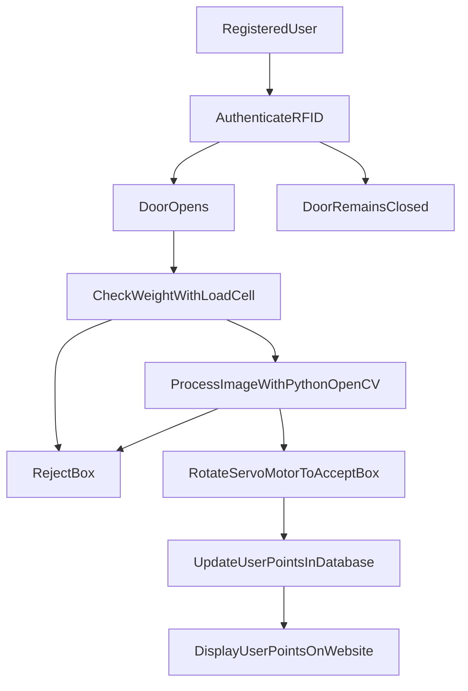

# Smart Plastic Bottle Redemption System
Welcome to the Smart Plastic Bottle Redemption System! This project integrates RFID authentication, Arduino-based servo motor control, load cell weight verification, and image classification using OpenCV and TensorFlow to create an automated bottle redemption machine.

### Table of Contents
* [Project Overview](Project_Overview)
* [Features](Features)
* [Technologies Used](Technologies_Used)
* [Installation](Installation)
* [Usage](Usage)
* [Project Structure](Project_Structure)
* [Contributing](Contributing)
* [License](License)
* [Acknowledgements](Acknowledgements)

### Project Overview
The Smart Plastic Bottle Redemption System is designed to automate the process of accepting and classifying plastic bottles for recycling. The system uses RFID to authenticate users, a load cell to verify the weight of the bottle, and a pre-trained MobileNetV2 model to classify the object as a plastic bottle or reject it. Points are awarded to registered users, which they can view on a web interface.

### Features
* RFID User Authentication: Ensures only registered users can use the machine.
* Load Cell Weight Verification: Accepts objects weighing between 17g-23g.
* Image Classification: Uses OpenCV and TensorFlow to classify objects.
* Servo Motor Control: Directs accepted bottles to an acceptance box and rejected items to a rejection box.
* User Points Database: Awards points to users for accepted bottles and provides a web interface to view points.
* User Guidance Display: An Arduino 16x2 LCD provides step-by-step instructions.

### Technologies Used
* Arduino: For controlling servo motors and displaying messages.
* RFID: For user authentication.
* Load Cell: For weight verification.
* OpenCV: For capturing and processing images.
* TensorFlow: For image classification using a pre-trained MobileNetV2 model.
* Python: Backend logic for image processing and machine learning.
* Xampp: For the web interface to display user points.
* SQLite: For user and points database.

### Installation
**Hardware Setup**
1. Arduino and RFID Setup:
   * Connect the RFID reader to the Arduino.
   * Connect the servo motors to the Arduino.
   * Connect the 16x2 LCD display to the Arduino.
   * Connect the load cell to the Arduino using an HX711 amplifier.

2. Camera Setup:

   * Ensure your laptop’s built-in camera or an external camera is set up for image capture.
**Software Setup**
1. Clone the Repository:<br>
   ```sh
   https://github.com/chamishkadilina/Smart-Plastic-Bottle-Redemption-System.git
   ```
2. Set Up Python Environment:
3. Arduino Code:
   * Upload the ```arduino/arduino_code.ino``` to the Arduino board using the Arduino IDE.
4. Configure Database:
### Usage
1. Start the Arduino Program:
2. Run the Main Python Program:
3. User Interaction:
   * Users authenticate with their RFID cards.
   * Place the bottle on the load cell.
   * If the weight is correct, the camera captures an image and the classification process begins.
   * The servo motor directs the bottle to the appropriate box based on the classification.
   * Accepted bottles add points to the user's account, viewable on the web interface.
### Project Structure

### Contributing
We welcome contributions! Please read our [Contributing Guidelines]() for more information.
### License
This project is licensed under the MIT License. See the [LICENSE]() file for details.
### Acknowledgements
   * Special thanks to our project team members.
     * CT/2020/027 - J.A.C.D.Kumara
     * CT/2020/047 - H.I.K.Jayarathna
     * CT/2020/065 - E.D.K.Chamara
     * ET/2020/010 - G.G.H.N. Kokilani
     * ET/2020/015 - P.C.Vithanage
     * ET/2020/098 - A.S.S.Sisiranatha
   * Inspired by various open-source projects and tutorials on Arduino, OpenCV, and TensorFlow.
