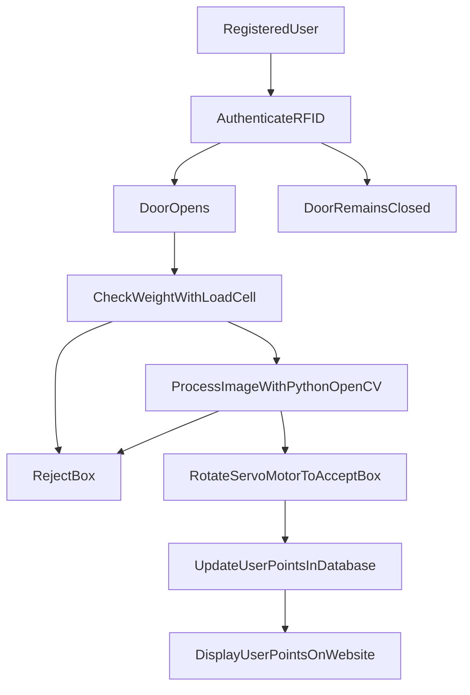

# Smart Plastic Bottle Redemption System
### Project Overview
This project involves a machine equipped with an RFID card reader to authenticate users. Users can insert bottles into the machine, which then classifies and detects if the item is a bottle. If it is a bottle, the user's points are updated on a webpage; if not, the machine rejects the item.

### Useful Arduino pin-outs


### Table of Contents
* [Features](Features)
* [Technologies Used](Technologies_Used)
* [Project Setup Guide](Project_Setup_Guide)
* [Usage](Usage)
* [Project Structure](Project_Structure)
* [License](License)
* [Acknowledgements](Acknowledgements)
* [Contributing](Contributing)

### Features
* RFID Authentication: Access control for registered users.
* Load Cell Verification: Checks weight (17g-23g) of objects.
* Image Classification: Uses OpenCV and TensorFlow to detect bottles.
* Servo Motor Control: Directs items based on classification results.
* User Points Database: Tracks user points, accessible via a web interface.

### Technologies Used
* Arduino, RFID, Load Cell, OpenCV, TensorFlow, Python, XAMPP, SQLite

### Project Setup Guide
* Refer the ```Project Setup Guide.md``` file for detailed instructions.

### Usage
1. Launch XAMPP Control Panel and Start ```Apache``` and ```MySQL``` services.
2. In your browser, navigate to ```http://localhost/display_data.php``` to view the webpage.
1. Start the Arduino Program ```SmartRecycler.ino```.
2. Run the Main Python Program ```arduino_communication.py```.
3. User Interaction:
   * Users authenticate with their RFID cards.
   * Place the bottle on the load cell.
   * If the weight is correct, the camera captures an image and the classification process begins.
   * The servo motor directs the bottle to the appropriate box based on the classification.
   * Accepted bottles add points to the user's account, viewable on the web interface.

### Project Structure

### License
This project is licensed under the MIT License. See the [LICENSE]() file for details.

### Acknowledgements
   * Special thanks to our project team members.
     * CT/2020/027 - J.A.C.D.Kumara
     * CT/2020/047 - H.I.K.Jayarathna
     * CT/2020/065 - E.D.K.Chamara
     * ET/2020/010 - G.G.H.N. Kokilani
     * ET/2020/015 - P.C.Vithanage
     * ET/2020/098 - A.S.S.Sisiranatha
   * Inspired by various open-source projects and tutorials on Arduino, OpenCV, and TensorFlow.

### Contributing
Contributions are welcome! If you find any issues or want to add new features, feel free to fork the repository and submit a pull request.
